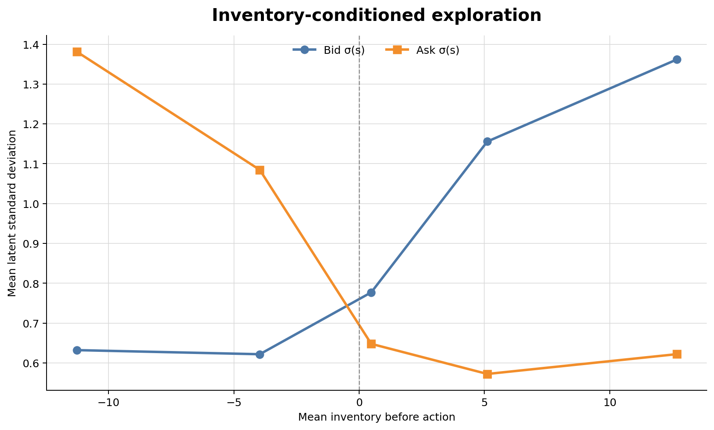
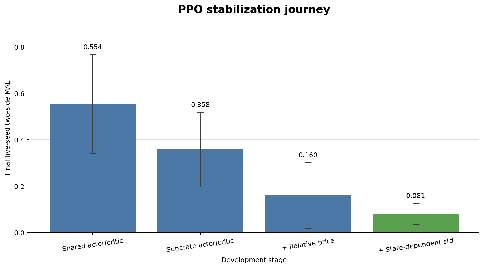

# RL Market Making: PPO Stability and State-Dependent Exploration

A research implementation of reinforcement learning for market making in a simulated multi-dealer market, inspired by **Ganesh et al., “Reinforcement Learning for Market Making in a Multi-agent Dealer Market” (NeurIPS 2019)**.

This project began as a reproduction of the paper's PPO market maker. It evolved into a systematic investigation of a more basic question:

> **Why can an apparently correct PPO market-making policy learn reasonable quotes early in training, yet become unstable across seeds or drift over long horizons?**

The implementation was first audited for market-event timing, inventory signs, PnL accounting, bounded-action likelihoods, GAE, and rollout bootstrapping. I then ran controlled multi-seed experiments on network architecture, observation scaling, policy variance, KL regularization, critic targets, value clipping, entropy regularization, bounded policy distributions, and PPO batch reuse.

The strongest result so far is that **state-dependent policy variance** substantially improves long-run mean-policy stability. Against a random competitor, it roughly halves deterministic quote error and reduces cross-seed dispersion by about two thirds. The improvement also generalizes to a persistent competitor, where the learned variance develops a clear inventory-dependent structure.

This repository is a **behavioral replication and RL investigation**, not an exact numerical reproduction of the original paper.

The pure, environment-independent Adaptive Market Maker Phase 1 decision logic
and its documented interpretation choices are described in
[`docs/adaptive_market_maker.md`](docs/adaptive_market_maker.md).

---

## Key findings

### 1. Correct PPO semantics matter

The simulator and learner were audited before interpreting learning results.

The corrected implementation uses:

- dealer-perspective inventory signs;
- explicit hedge → investor flow → price move → inventory-PnL timing;
- consistent PnL accounting;
- tanh-squashed continuous actions;
- Jacobian-corrected transformed log probabilities;
- identical sampled, executed, stored, and reevaluated PPO actions;
- GAE with rollout-boundary bootstrapping;
- standard PPO clipped policy ratios.

See [`docs/correctness_audit.md`](docs/correctness_audit.md).

---

### 2. Observation scaling was a major source of instability

The original observation fed the raw mid-price, approximately `100`, directly into a tanh MLP while most other state variables lived on much smaller scales.

Replacing

```text
price feature = P_t
```

with

```text
price feature = P_t / P_0 - 1
```

reduced first-layer actor saturation from approximately **97% to 33–34%**.

At 204,800 training steps:

| Metric | Raw price | Relative price |
|---|---:|---:|
| Final deterministic two-side MAE | 0.3582 | **0.1601** |
| Seed dispersion | 0.1608 | **0.1424** |
| Worst-side error | 0.9158 | **0.4326** |

Observation scaling removed the most extreme failures, but seed-specific long-run drift remained.

Detailed report: [`results/relative_price/report_zh.md`](results/relative_price/report_zh.md)

---

### 3. State-dependent exploration produced the largest robust improvement

The original custom PPO used a global trainable variance:

```text
mu = mu_theta(s)
log sigma = trainable global parameter
```

I replaced it with

```text
mu = mu_theta(s)
log sigma(s) = Linear(actor_hidden)
```

with the variance head initialized so that `sigma(s) = 1` for every state at the beginning of training.

Everything else was held fixed.

Against the Random competitor, using five seeds and 204,800 steps:

| Metric | Global std | State-dependent std | Change |
|---|---:|---:|---:|
| Final two-side MAE | 0.1601 | **0.0808** | **-49.5%** |
| Seed dispersion | 0.1424 | **0.0467** | **-67.2%** |
| Worst-side error | 0.4326 | **0.2250** | **-48.0%** |

Four of five paired seeds improved.

Importantly, this was **not simply variance collapse**.

| Variance diagnostic | Global std | State-dependent std |
|---|---:|---:|
| Mean latent sigma, bid | 0.980 | 0.986 |
| Mean latent sigma, ask | 0.974 | 0.917 |
| State std of bid sigma | 0 | **0.259** |
| State std of ask sigma | 0 | **0.271** |
| Sampled bid action std | 0.751 | **0.655** |
| Sampled ask action std | 0.685 | **0.695** |

The policy remained highly stochastic. The major structural change was that it could **reallocate exploration across states**.

Detailed report: [`results/state_dependent_std/report_zh.md`](results/state_dependent_std/report_zh.md)

---

### 4. The state-dependent variance result generalizes across competitors

The same comparison was repeated against a deterministic Persistent market maker quoting

```text
epsilon_bid = 0.5
epsilon_ask = 0.5
hedge_fraction = 0
```

using matched five-seed, 204,800-step runs.

State-dependent variance reduced cross-seed instability:

| Final deterministic policy statistic | Global std | State-dependent std |
|---|---:|---:|
| Bid seed dispersion | 0.3881 | **0.1753** |
| Ask seed dispersion | 0.2603 | **0.2456** |
| Mean bid/ask dispersion | 0.3242 | **0.2105** |

The improvement was asymmetric—the bid side improved much more strongly than the ask side—but the catastrophic two-sided runaway seen in the global-variance policy disappeared.

Economic metrics also improved:

| Five-seed mean | Global std | State-dependent std |
|---|---:|---:|
| Market share | 0.7128 | **0.8068** |
| Spread PnL / step | 0.1855 | **0.2460** |
| Total PnL / step | 0.1078 | **0.2063** |
| Inventory std | 10.7631 | **8.5167** |

This provides evidence that the improvement is not specific to the analytical Random-competitor benchmark.

Detailed report: [`results/persistent_state_dependent_std/report_zh.md`](results/persistent_state_dependent_std/report_zh.md)

---

## Inventory-conditioned exploration



The state-dependent variance is not arbitrary.

Using 26,000 final evaluation states from five Persistent-competitor runs, inventory was divided into common quintiles and the learned bid/ask latent standard deviations were measured conditionally.

| Inventory bin | Mean inventory | Sigma bid | Sigma ask | Bid − ask |
|---|---:|---:|---:|---:|
| Lowest 20% | -11.269 | 0.632 | 1.381 | **-0.749** |
| Q2 | -3.964 | 0.622 | 1.085 | **-0.463** |
| Q3 | 0.483 | 0.777 | 0.648 | **0.129** |
| Q4 | 5.116 | 1.156 | 0.572 | **0.584** |
| Highest 20% | 12.671 | 1.362 | 0.622 | **0.740** |

For four of five independent seeds,

```text
sigma_bid(s) - sigma_ask(s)
```

increased monotonically across the five inventory bins.

The economic interpretation is consistent with inventory management:

- when inventory is **short**, the dealer needs to buy, and the policy uses relatively lower variance on the **bid** side;
- when inventory is **long**, the dealer needs to sell, and the policy uses relatively lower variance on the **ask** side;
- the opposite quoting side is allowed substantially more exploration.

In other words, the policy appears to become relatively more certain on the side that corrects its inventory.

This is a **conditional association**, not a causal feature-attribution claim.

Detailed report: [`results/inventory_variance_analysis/report_zh.md`](results/inventory_variance_analysis/report_zh.md)

---

## From unstable PPO to the current reference policy



The most useful improvements came from a sequence of controlled changes rather than a hyperparameter sweep.

Each row below builds on the preceding configuration.

| Configuration | Final MAE | Seed dispersion | Worst-side error |
|---|---:|---:|---:|
| Shared actor/critic | 0.5542 | 0.2135 | 0.8784 |
| Separate actor/critic | 0.3582 | 0.1608 | 0.9158 |
| + Relative-price observation | 0.1601 | 0.1424 | 0.4326 |
| + **State-dependent std** | **0.0808** | **0.0467** | **0.2250** |

The individual experiments suggest:

1. sharing actor and critic representations contributed to early runaway behavior;
2. raw-price scaling caused severe tanh saturation;
3. fixing those issues substantially improved average policy quality;
4. the largest remaining stability improvement came from allowing exploration scale to depend on state.

Detailed reports:

- [`results/separate_actor_critic/report_zh.md`](results/separate_actor_critic/report_zh.md)
- [`results/relative_price/report_zh.md`](results/relative_price/report_zh.md)
- [`results/state_dependent_std/report_zh.md`](results/state_dependent_std/report_zh.md)

---

## PPO mechanisms that did *not* robustly solve the problem

A recurring result in this project is:

> **Better-looking optimization diagnostics do not necessarily imply a better final policy.**

Several plausible PPO modifications were tested independently.

| Experiment | Result | Decision |
|---|---|---|
| Fixed KL penalty | Reduced policy movement but worsened mean-policy accuracy | Stop |
| GAE lambda-return critic target | Dramatically improved critic loss but worsened final policy | Stop |
| Value-loss clipping | Clipped most large critic errors and sharply degraded policy quality | Stop |
| Beta bounded-action policy | No consistent improvement over squashed Gaussian | Stop |
| Remove entropy bonus | State-dependent variance survived, but seed stability did not improve | Stop |
| Reduce PPO epochs 10 → 3 | Strong improvement at 60k–100k, reversed by 200k | Stop |

Reports:

- [`results/fixed_kl/report_zh.md`](results/fixed_kl/report_zh.md)
- [`results/gae_value_target/report_zh.md`](results/gae_value_target/report_zh.md)
- [`results/value_loss_clip/report_zh.md`](results/value_loss_clip/report_zh.md)
- [`results/beta_policy_screen/report_zh.md`](results/beta_policy_screen/report_zh.md)
- [`results/ppo_mechanism_screen/report_zh.md`](results/ppo_mechanism_screen/report_zh.md)
- [`results/epochs_3_confirmation/report_zh.md`](results/epochs_3_confirmation/report_zh.md)

### Example: fewer PPO epochs

At 100k steps, reducing PPO epochs from 10 to 3 looked exceptionally promising.

The three-epoch policy had roughly half the MAE of the ten-epoch baseline.

A five-seed, 204,800-step confirmation changed the conclusion:

| Final metric | 10 epochs | 3 epochs |
|---|---:|---:|
| Two-side MAE | **0.0808** | 0.1021 |
| Seed dispersion | 0.0467 | **0.0376** |
| Worst-side error | 0.2250 | **0.1977** |
| Paired wins for 3 epochs | — | **1 / 5** |

The three-epoch policy was clearly better around 60k–100k, but its advantage disappeared after approximately 150k and reversed near 200k.

Meanwhile, its approximate KL and PPO clipping fraction remained substantially lower.

This gives a useful counterexample:

> **Smaller PPO updates can delay instability without producing a better long-run mean policy.**

---

## Modern RLlib reference

A modern RLlib PPO agent was also trained on exactly the same simplified five-feature Random-competitor environment.

This is **not** an attempt to reproduce the historical 2019 RLlib implementation. It is an external learner reference.

Compared with the earlier custom global-variance PPO:

| Metric | Custom PPO | Modern RLlib |
|---|---:|---:|
| Final two-side MAE | 0.1601 | **0.1223** |
| Seed dispersion | 0.1424 | **0.0577** |
| Worst-side error | 0.4326 | **0.3073** |

RLlib still exhibited transient policy drift, but the drift tended to recover rather than becoming persistent catastrophic runaway.

The experiment was useful because it showed that the simplified environment itself was learnable and shifted attention toward learner and policy-parameterization choices.

After introducing state-dependent variance, the custom PPO's Random-benchmark MAE became `0.0808`.

That comparison should **not** be interpreted as a claim that the custom PPO generally “beats RLlib”: the policy distributions and learner stacks are different.

Detailed report: [`results/rllib_reference/report_zh.md`](results/rllib_reference/report_zh.md)

---

## Market environment

The current research baseline uses a two-dealer simulated market.

At each timestep:

1. the RL dealer observes the current state;
2. it chooses bid aggressiveness, ask aggressiveness, and a hedge fraction;
3. existing inventory is hedged;
4. investors route orders to the dealer offering the better quote;
5. inventory is updated from dealer-perspective signed flow;
6. the mid-price evolves;
7. inventory PnL is realized on post-hedge, post-flow inventory.

The action is

```text
(epsilon_bid, epsilon_ask, hedge_fraction)
```

with

```text
epsilon_bid, epsilon_ask in [-1, 1]
hedge_fraction in [0, 1]
```

Quotes are parameterized relative to a reference spread:

```text
dealer spread ~= reference spread * (1 + epsilon)
```

so a smaller epsilon corresponds to a tighter, more aggressive quote.

Inventory convention:

```text
dealer buys  -> positive inventory
dealer sells -> negative inventory
```

PnL accounting is

```text
TotalPnL = SpreadPnL + InventoryPnL - HedgeCost
```

where `HedgeCost >= 0`.

---

## Current reference configuration

The following is the **current research reference**, not a claim of globally optimal PPO hyperparameters.

| Component | Current reference |
|---|---|
| Observation | `[inventory, relative_price, total_pnl, inventory_pnl, hedge_cost]` |
| Price feature | `P_t / P_0 - 1` |
| Actor | separate `2 × 256` tanh MLP |
| Critic | separate `2 × 256` tanh MLP |
| Policy | state-dependent tanh-squashed Gaussian |
| Bid / ask support | `[-1, 1]` |
| Hedge support | `[0, 1]` |
| Investors | 20 per step |
| Investor size | unit |
| Buy probability | 0.5 |
| Market volatility | 0.2 |
| PPO learning rate | `5e-5` |
| PPO clip | `0.3` |
| Discount | `0.999` |
| GAE lambda | `0.95` |
| Minibatch | `256` |
| Epochs / rollout | `10` |
| Entropy coefficient | `0.003` |
| Value coefficient | `0.5` |
| Global grad clip | `0.5` |
| Value clipping | none |
| Explicit KL penalty | none |
| Long-run budget | `204,800` environment steps |
| Main competitors | Random, Persistent |

Experiments set these values explicitly so that historical runs remain reproducible even where the global `Config` defaults differ.

---

## Analytical benchmark

For the Random competitor,

```text
epsilon_bid, epsilon_ask ~ Uniform[-1, 1]
```

the deterministic best response in the simplified spread-only setting is

```text
epsilon* = 0.
```

This provides a useful diagnostic target independent of noisy PnL.

For this reason, much of the stability analysis focuses on the deterministic mean-policy quote error

```text
two_side_MAE =
    (abs(mean_epsilon_bid) + abs(mean_epsilon_ask)) / 2
```

rather than treating raw episodic PnL as the primary learning metric.

The Persistent competitor instead quotes fixed `epsilon = 0.5`. Because the learned policy remains stochastic and routing is winner-take-all, its optimal stochastic response is not simply the deterministic `0.5-` benchmark.

See [`experiments/analytical_response.py`](experiments/analytical_response.py).

---

## PPO action distribution

The main custom policy uses a Gaussian in latent space:

```text
u ~ Normal(mu(s), sigma(s))
```

with transformed actions

```text
epsilon_bid = tanh(u_bid)
epsilon_ask = tanh(u_ask)
hedge       = (tanh(u_hedge) + 1) / 2
```

The PPO log probability includes the corresponding transformation Jacobian.

This is important because an earlier implementation sampled an unconstrained Gaussian action, clipped it in the environment, and then used the unclipped action likelihood in PPO.

That creates a mismatch between

```text
action sampled by policy
action executed by environment
action used in PPO ratio
```

and invalidates the intended importance ratio.

The current implementation stores and reevaluates the exact transformed action that the simulator receives.

---

## Reproducing the experiments

### Setup

```bash
python -m venv .venv
source .venv/bin/activate
pip install -r requirements.txt
```

### Correctness checks

```bash
python experiments/diagnostics.py
```

### Core long-run investigations

```bash
python experiments/long_run_random.py
python experiments/separate_actor_critic.py
python experiments/relative_price.py
python experiments/state_dependent_std.py
```

### Cross-competitor and mechanism validation

```bash
python experiments/persistent_state_dependent_std.py
python experiments/inventory_variance_analysis.py
```

### PPO mechanism experiments

```bash
python experiments/fixed_kl.py
python experiments/gae_value_target.py
python experiments/value_loss_clip.py
python experiments/beta_policy_screen.py
python experiments/ppo_mechanism_screen.py
python experiments/epochs_3_confirmation.py
```

### Modern RLlib reference

```bash
python experiments/rllib_reference.py
```

Many long-run experiments use five independent seeds and 204,800 training steps per seed and are therefore significantly more expensive than the default smoke runs.

---

## Experiment map

The `results/` directory is intentionally kept as an experimental record.

| Question | Report |
|---|---|
| Are timing, signs, PnL, and PPO likelihoods correct? | [`docs/correctness_audit.md`](docs/correctness_audit.md) |
| Does separating actor and critic reduce drift? | [`results/separate_actor_critic/report_zh.md`](results/separate_actor_critic/report_zh.md) |
| Is raw-price scale saturating the actor? | [`results/relative_price/report_zh.md`](results/relative_price/report_zh.md) |
| Is the environment learnable with a mature PPO stack? | [`results/rllib_reference/report_zh.md`](results/rllib_reference/report_zh.md) |
| Does state-dependent policy variance improve stability? | [`results/state_dependent_std/report_zh.md`](results/state_dependent_std/report_zh.md) |
| Does the result generalize to another competitor? | [`results/persistent_state_dependent_std/report_zh.md`](results/persistent_state_dependent_std/report_zh.md) |
| How is variance related to inventory? | [`results/inventory_variance_analysis/report_zh.md`](results/inventory_variance_analysis/report_zh.md) |
| Does a Beta policy improve bounded-action learning? | [`results/beta_policy_screen/report_zh.md`](results/beta_policy_screen/report_zh.md) |
| Do fewer epochs or zero entropy improve PPO? | [`results/ppo_mechanism_screen/report_zh.md`](results/ppo_mechanism_screen/report_zh.md) |
| Does the three-epoch result survive long training? | [`results/epochs_3_confirmation/report_zh.md`](results/epochs_3_confirmation/report_zh.md) |

Detailed reports are currently written in Chinese; code, configuration names, metrics, and experiment outputs use English identifiers.

---

## Relation to Ganesh et al. (2019)

This project is inspired by:

> Ganesh, S., Vadori, N., Xu, M., Zheng, H., Reddy, P., and Veloso, M.  
> **Reinforcement Learning for Market Making in a Multi-agent Dealer Market.**  
> NeurIPS 2019.  
> https://arxiv.org/abs/1911.05892

Several structural ideas come directly from the paper:

- dealer competition through relative quoting;
- bid/ask epsilon actions;
- inventory hedging;
- PPO market-making policies;
- Random and persistent analytical benchmarks;
- inventory-aware behavior;
- adaptive market-maker competition.

However, the current environment is intentionally simplified and does not reproduce the original setup numerically.

Important differences include:

- deterministic size-based reference spreads rather than the paper's calibrated stochastic spread process;
- a five-dimensional partial observation rather than the paper's richer market/trade-flow state;
- market parameters inherited from this project rather than exact paper calibration;
- custom PyTorch PPO rather than historical RLlib PPO;
- one competing dealer at a time;
- the Adaptive Market Maker is not yet implemented.

Results should therefore be interpreted as **controlled behavioral experiments**, not exact paper replication numbers.

---

## What this project currently suggests

The experiments do **not** support a simple story that PPO instability can be fixed by adding more regularization.

Instead, the current evidence points to three more structural lessons.

### Representation matters

A raw, poorly scaled observation can saturate a policy network and create failures that look like an RL optimization problem.

### Exploration parameterization matters

Giving the policy enough capacity to allocate stochasticity by state produced a much larger and more robust gain than replacing the distribution family or explicitly shrinking policy updates.

### Local optimization diagnostics can be misleading

Lower critic loss, lower KL, lower PPO clipping frequency, or better intermediate-training performance did not reliably predict the final long-run policy.

This is why the project evaluates policies across:

```text
multiple random seeds
long training horizons
matched environment streams
deterministic mean-policy benchmarks
stochastic economic metrics
```

rather than selecting configurations from a single training curve.

---

## Next: Adaptive Market Maker

The next extension is the paper's **Adaptive Market Maker**, which turns the environment from competition against a stationary opponent into a genuinely non-stationary multi-agent problem.

The planned first implementation will focus on the canonical paper-style configuration:

```text
target market share = 0.50
risk aversion gamma = 2
response-table forgetting beta = 0.35
```

The Adaptive dealer will maintain online estimates of quote response, choose a base spread to target market share, skew quotes to manage inventory, and choose a hedge fraction from a risk/cost tradeoff.

Before training PPO against it, the implementation will be validated independently for:

1. market-share targeting;
2. economically signed inventory skew;
3. risk-sensitive hedging behavior.

This will test whether the current PPO policy remains effective when its competitor itself adapts to the RL dealer.

---

## Repository layout

```text
.
├── src/
│   ├── config.py
│   ├── environments.py
│   ├── evaluation.py
│   ├── market.py
│   ├── networks.py
│   └── ppo.py
│
├── experiments/
│   ├── diagnostics.py
│   ├── long_run_random.py
│   ├── separate_actor_critic.py
│   ├── relative_price.py
│   ├── state_dependent_std.py
│   ├── persistent_state_dependent_std.py
│   ├── inventory_variance_analysis.py
│   ├── rllib_reference.py
│   └── ...
│
├── results/
│   ├── relative_price/
│   ├── state_dependent_std/
│   ├── persistent_state_dependent_std/
│   ├── inventory_variance_analysis/
│   ├── rllib_reference/
│   └── ...
│
├── docs/
│   ├── correctness_audit.md
│   └── replication_findings.md
│
├── notebooks/
│   └── analysis.ipynb
│
└── archive/
    └── original project artifacts
```

- `src/` contains the single simulator/PPO implementation used by the experiments.
- `experiments/` contains controlled research runs and diagnostics.
- `results/` stores experiment-level metrics, trajectories, and reports.
- `docs/` contains implementation and replication audits.
- `notebooks/` is analysis-only.
- `archive/` preserves the original notebook-era project unchanged.

---

## Project status

Current reference policy:

```text
5D relative-price observation
separate actor / critic
state-dependent squashed Gaussian
10 PPO epochs
```

Confirmed findings:

```text
✓ bounded-action PPO correctness
✓ event-timing and PnL audit
✓ analytical Random benchmark
✓ long-horizon multi-seed instability diagnosis
✓ actor/critic representation ablation
✓ observation-scaling diagnosis
✓ modern RLlib external reference
✓ state-dependent exploration improvement
✓ Persistent-competitor validation
✓ inventory-conditioned variance mechanism
✓ bounded Beta-policy screening
✓ entropy and batch-reuse ablations
```

Next milestone:

```text
→ Adaptive Market Maker
→ PPO vs adaptive opponent
→ non-stationary multi-agent market making
```
