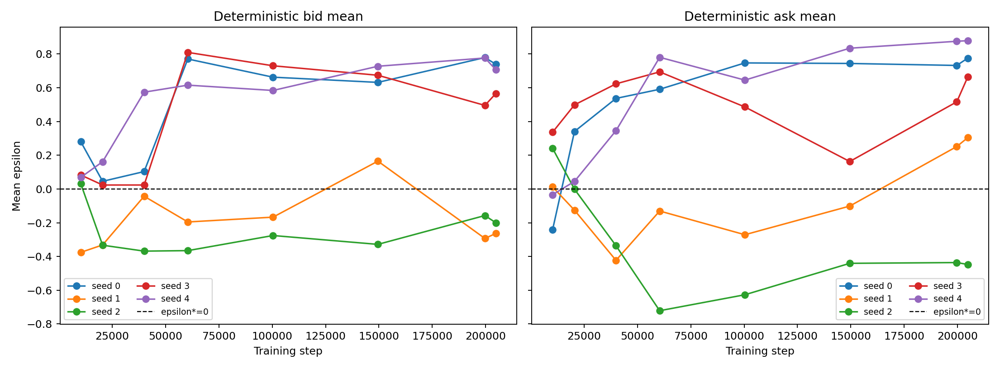
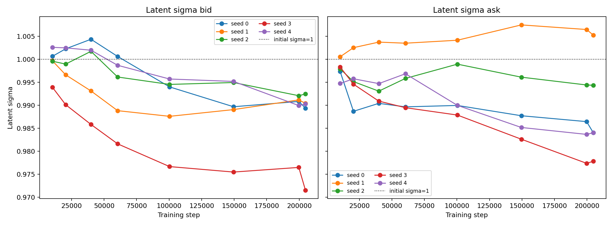

# Random Competitor Long-Run Convergence Study

## 结论

本实验属于 **Case D：long run 更不稳定**。

把训练预算从 20,480 增加到 204,800 steps 后，deterministic mean policy 没有向 analytical benchmark `epsilon*=0` 收敛，反而出现更大的 seed-dependent drift：

- 两侧综合 deterministic MAE 从 `0.1907` 增至 `0.5542`；
- per-seed MAE dispersion 从 `0.0553` 增至 `0.2135`；
- worst-side error 从 `0.5056` 增至 `0.8784`；
- latent sigma 只从约 `1.0` 降至约 `0.99`，没有形成 policy concentration。

因此：

> **训练预算不足不能解释主要 replication gap。当前 custom PPO 在 long horizon 下表现出明显的 optimization drift / instability。**

按停止条件，本轮没有修改 market sigma、observation、entropy、reward、PPO 参数，也没有切换 RLlib。

## 固定配置

唯一实验变量是 training budget：

| Setting | Value |
|---|---:|
| Investors | 20 independent unit-size orders / step |
| Buy probability | 0.5 |
| Competitor | Random `U[-1,1]` |
| Market sigma | 0.2 |
| Learning rate | `5e-5` |
| PPO clip | 0.3 |
| Network | 2 x 256, tanh |
| Minibatch size | 256 |
| PPO epochs | 10 |
| Horizon | 1,024 |
| Rollouts | 200 |
| Total steps | 204,800 |
| Gamma / GAE lambda | 0.999 / 0.95 |
| Entropy coefficient | 0.003 |
| Value coefficient | 0.5 |
| Max gradient norm | 0.5 |

保留 corrected routing、inventory signs、event timing、PnL accounting、reward、observation 和 Jacobian-corrected tanh-Gaussian actions。

Deterministic evaluations 位于 rollout-aligned checkpoints：`10,240 / 20,480 / 39,936 / 60,416 / 100,352 / 149,504 / 199,680 / 204,800`。20k comparison 使用上一轮相同 paper-oriented setup、相同 seeds 和相同 final evaluation paths；long-run training 在 20,480 steps 之前与该 run 配对一致。

## Q1：Mean policy 是否更接近 epsilon*=0？

**否，明显更差。**

| Final metric | 20,480 steps | 204,800 steps |
|---|---:|---:|
| deterministic bid mean | -0.0880 +/- 0.2062 | 0.3094 +/- 0.4462 |
| deterministic ask mean | 0.1520 +/- 0.2341 | 0.4346 +/- 0.4817 |
| bid MAE | 0.1789 +/- 0.1352 | 0.4949 +/- 0.2235 |
| ask MAE | 0.2024 +/- 0.1922 | 0.6135 +/- 0.2109 |
| two-side MAE | 0.1907 +/- 0.0553 | 0.5542 +/- 0.2135 |

Bid/ask MAE 分别增至短 run 的约 `2.77x` 和 `3.03x`。Checkpoint aggregate 显示 deterioration 主要在 20k 之后出现：

| Training step | Bid MAE | Ask MAE | Bid across-seed std | Ask across-seed std |
|---:|---:|---:|---:|---:|
| 10,240 | 0.1675 | 0.1726 | 0.2147 | 0.2050 |
| 20,480 | 0.1790 | 0.2021 | 0.2058 | 0.2313 |
| 39,936 | 0.2222 | 0.4526 | 0.3035 | 0.4417 |
| 60,416 | 0.5509 | 0.5832 | 0.5027 | 0.5799 |
| 100,352 | 0.4836 | 0.5550 | 0.4349 | 0.5447 |
| 149,504 | 0.5049 | 0.4563 | 0.4043 | 0.4882 |
| 204,800 | 0.4949 | 0.6134 | 0.4462 | 0.4816 |

多个 seeds 在 40k-60k 区间快速离开 0，此后只是在大的 offset 附近 drift 或 oscillate，而不是恢复收敛。

## Q2：跨 seed dispersion 是否下降？

**否，明显上升。Mean-policy instability 不是 premature stopping。**

- Signed bid dispersion：`0.2062 -> 0.4462`；
- Signed ask dispersion：`0.2341 -> 0.4817`；
- Per-seed two-side MAE dispersion：`0.0553 -> 0.2135`；
- Worst-side error：`0.5056 -> 0.8784`。

Final per-seed policies：

| Seed | det bid | det ask | two-side MAE | latent sigma bid | latent sigma ask |
|---:|---:|---:|---:|---:|---:|
| 0 | 0.7390 | 0.7754 | 0.7572 | 0.9894 | 0.9840 |
| 1 | -0.2634 | 0.3037 | 0.2835 | 0.9904 | 1.0053 |
| 2 | -0.2003 | -0.4472 | 0.3238 | 0.9925 | 0.9943 |
| 3 | 0.5654 | 0.6629 | 0.6141 | 0.9715 | 0.9778 |
| 4 | 0.7065 | 0.8784 | 0.7925 | 0.9903 | 0.9840 |

5/5 seeds 至少有一侧保持明显 offset；seeds 0、3、4 漂到较大的正 epsilon，seed 2 ask 则保持明显负 offset。Bad seeds 不仅没有消失，failure mode 还更普遍。

## Q3：Latent policy variance 是否明显下降？

**否。**

| Metric | 20,480 steps | 204,800 steps | Change |
|---|---:|---:|---:|
| latent sigma bid | 0.9981 +/- 0.0045 | 0.9868 +/- 0.0077 | -0.0113 |
| latent sigma ask | 0.9953 +/- 0.0044 | 0.9891 +/- 0.0097 | -0.0062 |
| sampled epsilon bid std | 0.6225 +/- 0.0079 | 0.5687 +/- 0.0463 | -0.0538 |
| sampled epsilon ask std | 0.6124 +/- 0.0175 | 0.5240 +/- 0.0762 | -0.0884 |

Latent sigma 在 184k additional steps 中只下降约 0.6%-1.1%，ask seed 1 甚至升到 `1.0053`。没有出现 `1.0 -> 0.8 -> 0.5` 的系统性 concentration。

Sampled epsilon std 的下降明显大于 latent sigma，是因为多个 deterministic means 漂近 tanh bounds，导致 transformed actions 被压缩。它不能被解释为成功的 variance learning。

## Q4：Mean convergence 与 variance learning 是否为不同问题？

**是，但本实验中两者都没有解决。** Latent variance 长期停留在约 1，说明 variance learning 仍是独立问题；与此同时 deterministic mean 在 20k 后明显漂离 analytical optimum，说明 mean-policy optimization 本身也存在 long-horizon instability。Observed sampled std 下降不能掩盖 mean error 的恶化。

## Q5：Training budget 能否解释主要 replication gap？

**不能。** 更长训练没有修复 seed-dependent offset，反而将 combined MAE 提高约 `2.91x`，并将 dispersion 提高约 `3.86x`。

本轮应归类为：

> **Case D — Long-run 更不稳定。当前 custom PPO update dynamics 可能存在长期 optimization instability。**

如果继续，计划定义的候选下一步是受控的 RLlib reference comparison；但本轮按要求在 long-run 结果后停止，没有自动执行 framework comparison。

## Secondary metrics

| Metric | 20,480 steps | 204,800 steps |
|---|---:|---:|
| market share | 0.4911 +/- 0.0614 | 0.3620 +/- 0.1567 |
| spread PnL / step | 0.13043 +/- 0.00206 | 0.11221 +/- 0.01590 |
| inventory std | 9.1390 +/- 1.1853 | 9.6723 +/- 1.8682 |
| Total PnL / episode | 16.9092 +/- 20.2544 | 33.3800 +/- 24.5676 |

Market share 和 spread PnL 随 extreme quotes 恶化。Total PnL 受 inventory-PnL noise 影响反而上升，本轮不据此展开额外 investigation。

