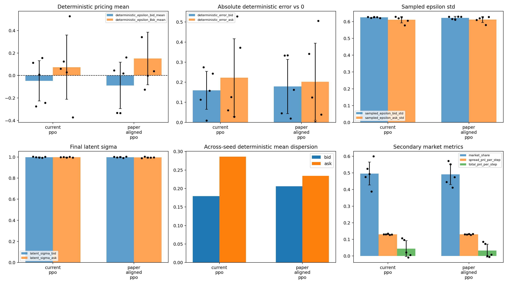
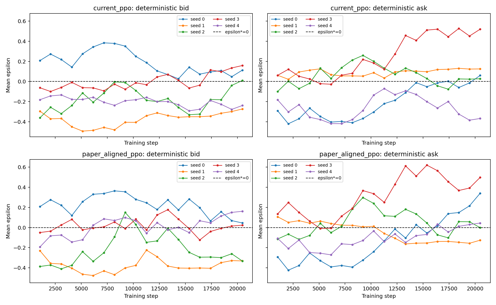
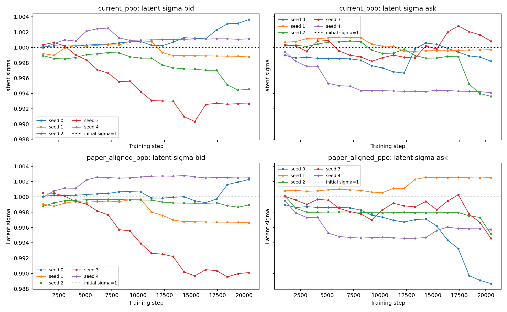

# Paper-Aligned PPO：Unit Flow Random 五种子比较

## 配置与实验边界

Environment：

- 每 timestep 20 个独立 unit-size investors；
- buy/sell probability 各 0.5；
- Random competitor `U[-1,1]`；
- 两组使用相同 5 seeds、相同外生 RNG streams；
- 保留 corrected routing、inventory signs、event timing、PnL accounting 和 bounded tanh-Gaussian PPO。

直接从当前代码确认的配置如下：

| Parameter | Current PPO | Paper-aligned PPO |
|---|---:|---:|
| learning rate | `5e-5` | `5e-5` |
| PPO clip | `0.2` | `0.3` |
| network | 2 x 256, tanh | 同左 |
| minibatch size | 256 | 同左 |
| n_epochs | 10 | 同左 |
| rollout length | 1,024 | 同左 |
| rollouts / total steps | 20 / 20,480 | 同左 |
| gamma | 0.999 | 同左 |
| GAE lambda | 0.95 | 同左 |
| entropy coefficient | 0.003 | 同左 |
| value-function coefficient | 0.5 | 同左 |
| max gradient norm | 0.5 | 同左 |

论文明确报告、且本轮计划对齐的 learning rate 已经与当前代码相同。因此本实验**不是 learning-rate reduction experiment**；唯一实际变化是 PPO clip `0.2 -> 0.3`。未对论文没有明确披露的参数猜测旧 RLlib defaults。

每 1,024 training steps 使用相同的短 deterministic evaluation paths 记录 mean-policy trajectory。Final metrics 使用每 seed 10 个 20-day episodes。

## 结论摘要

1. **Analytical best-response accuracy 没有实质改善。** 两侧合并 deterministic MAE 为 `0.1911 -> 0.1907`，几乎完全相同。
2. **Seed stability 只有有限、混合的改善。** 每 seed 合并 MAE 的 dispersion 从 `0.1243` 降至 `0.0553`，但 bid signed-mean dispersion 反而变大，且 `|epsilon| ~= 0.5` 的 bad seed 仍存在。
3. **Policy variance 没有下降。** Final latent bid/ask sigma 仍约为 `1.0`；sampled epsilon std 仍约为 `0.61-0.62`。
4. **Mean-policy trajectory 没有变得更平滑。** Paper-aligned 组的 bid/ask checkpoint-to-checkpoint roughness 反而分别高约 34% 和 19%。
5. **主要结果不是 mean policy 更准确，也不是 variance 更低。** Clip `0.3` 只是重新分配了不同 seeds/两侧的误差，未关闭 replication gap。
6. **如果目标仍是解释论文差距，下一步值得做一个严格受限的 RLlib reference comparison。** 它应是 framework-level diagnosis，不应继续在 custom PPO 上无目标调参；本轮没有运行 RLlib。

## Final per-seed deterministic policy

Random competitor 的 analytical deterministic benchmark 为 `epsilon*=0`。

| Config | Seed | det bid | det ask | bid error | ask error | per-seed two-side MAE |
|---|---:|---:|---:|---:|---:|---:|
| Current | 0 | 0.1133 | 0.0602 | 0.1133 | 0.0602 | 0.0867 |
| Current | 1 | -0.2745 | 0.1257 | 0.2745 | 0.1257 | 0.2001 |
| Current | 2 | 0.0092 | 0.0282 | 0.0092 | 0.0282 | 0.0187 |
| Current | 3 | 0.1574 | 0.5278 | 0.1574 | 0.5278 | 0.3426 |
| Current | 4 | -0.2432 | -0.3718 | 0.2432 | 0.3718 | 0.3075 |
| Paper-aligned | 0 | 0.0450 | 0.3417 | 0.0450 | 0.3417 | 0.1934 |
| Paper-aligned | 1 | -0.3328 | -0.1247 | 0.3328 | 0.1247 | 0.2287 |
| Paper-aligned | 2 | -0.3345 | -0.0013 | 0.3345 | 0.0013 | 0.1679 |
| Paper-aligned | 3 | 0.0197 | 0.5056 | 0.0197 | 0.5056 | 0.2627 |
| Paper-aligned | 4 | 0.1624 | 0.0388 | 0.1624 | 0.0388 | 0.1006 |

Current 组的 worst side error 是 seed 3 ask `0.5278`；paper-aligned 组仍有 seed 3 ask `0.5056`，同时 seeds 1/2 的 bid 均约为 `-0.33`。此前 unit-flow 3-layer run 中的 `ask ~= 0.7+` 没有在本次 2-layer current baseline 中复现，但 bad seeds 并没有消失，只是位置和方向改变。

## Accuracy 与 across-seed stability

以下 `+/-` 为 5 seeds 的 mean 和 population std。

| Metric | Current PPO | Paper-aligned PPO |
|---|---:|---:|
| deterministic bid mean | -0.0476 +/- 0.1794 | -0.0880 +/- 0.2062 |
| deterministic ask mean | 0.0740 +/- 0.2862 | 0.1520 +/- 0.2341 |
| deterministic bid MAE | 0.1595 +/- 0.0948 | 0.1789 +/- 0.1352 |
| deterministic ask MAE | 0.2227 +/- 0.1944 | 0.2024 +/- 0.1922 |
| two-side MAE per seed | 0.1911 +/- 0.1243 | 0.1907 +/- 0.0553 |
| global worst-side error | 0.5278 | 0.5056 |

Paper-aligned PPO 的 bid accuracy 变差、ask accuracy 略好，两者抵消后整体 MAE 只下降 `0.00046`。Per-seed combined error 更均匀，但这不是 robust convergence：signed bid dispersion 从 `0.1794` 增至 `0.2062`，signed ask dispersion 从 `0.2862` 降至 `0.2341`，而 worst error 仍超过 0.5。

## Mean-policy training dynamics

逐 seed 轨迹显示失败模式不是统一的 late-stage sudden divergence：

- 有些 seed 从早期就保持明显 offset，例如两组的 seed 1 bid；
- 有些 seed 在中期发生 drift，例如 current seed 3 ask 在约 12k steps 后升至 0.4-0.5；
- paper-aligned seed 0 ask 从负值逐渐穿过 0，最终明显偏正；
- 多个轨迹持续 oscillate，没有稳定收敛到 0。

以相邻 1,024-step checkpoints 的 mean absolute change 衡量 roughness：

| Side | Current PPO | Paper-aligned PPO | Relative change |
|---|---:|---:|---:|
| bid | 0.0489 | 0.0654 | +33.8% |
| ask | 0.0571 | 0.0680 | +18.9% |

因此不能声称 paper-reported setting 使 actor mean trajectory 更平滑。由于 learning rate 两组相同，本轮也不能回答“更小 learning rate 是否更稳定”。

## Variance dynamics

| Metric | Current PPO | Paper-aligned PPO |
|---|---:|---:|
| sampled bid std | 0.6249 +/- 0.0031 | 0.6225 +/- 0.0079 |
| sampled ask std | 0.6114 +/- 0.0188 | 0.6124 +/- 0.0175 |
| latent bid sigma | 0.9981 +/- 0.0041 | 0.9981 +/- 0.0045 |
| latent ask sigma | 0.9973 +/- 0.0029 | 0.9953 +/- 0.0044 |

Latent sigma 的 paired mean change 只有 bid `-0.00005`、ask `-0.00195`，在 seed variation 下没有实际意义。Sampled epsilon std 也基本不变。这次不存在可被误认成 variance reduction 的大幅 tanh-saturation effect；policy concentration gap 保持原样。

## Clip 0.3 的 observed optimization behavior

本轮只实际改变 clip threshold。附加 logging 显示：

| Diagnostic | Current 0.2 | Paper-aligned 0.3 |
|---|---:|---:|
| mean clip fraction | 0.0815 | 0.0512 |
| mean approximate KL | 0.00775 | 0.01010 |

更宽的 threshold 自然使 measured clip fraction 更低，同时 observed approximate KL 和 actor-mean roughness 更高。最终 accuracy 没有改善，因此没有证据表明 clip `0.3` 在当前 custom PPO、预算和 environment 下更接近论文结果。这里不进一步做 clip ablation，也不把其他 framework differences 错归因于 clip。

## Secondary metrics

| Metric | Current PPO | Paper-aligned PPO |
|---|---:|---:|
| market share | 0.4960 +/- 0.0687 | 0.4911 +/- 0.0614 |
| spread PnL / step | 0.13035 +/- 0.00261 | 0.13043 +/- 0.00206 |
| inventory std | 9.0109 +/- 0.9674 | 9.1390 +/- 1.1853 |
| Total PnL / episode | 23.2236 +/- 24.9557 | 16.9092 +/- 20.2544 |

Market share 和 spread PnL 几乎不变。Total PnL 的 seed noise 很大，且不是本轮主要判断指标。

## 与论文的剩余 gap 和停止决定

Paper-aligned group 仍有：

- deterministic two-side MAE 约 `0.191`；
- worst-side error 约 `0.506`；
- latent sigma 约 `1.0`；
- sampled action std 约 `0.61-0.62`；
- 持续 offset、drift 与 oscillation 的 mean-policy trajectories。

因此只对齐论文明确报告的 learning rate/clip，并未复现 mean near zero 且 policy 集中的结果。按停止条件，本轮未切换 RLlib、未改 reward、未做 entropy/state/hyperparameter sweep。
