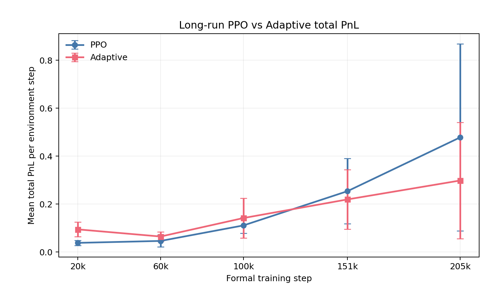

# PPO vs Adaptive Market Maker

This report provides the canonical English account of the Adaptive benchmark,
including the response-tracking pathology, the project-specific probing extension,
long-run economics, and spread normalization. The original
[Chinese long-run research record](report_zh.md) is retained.

## Why This Benchmark Is Difficult

A fixed competitor defines a stationary response surface. The Adaptive Market Maker
does not: it updates its beliefs about quote response while PPO simultaneously changes
its policy. Both dealers therefore affect the transition and reward distribution seen
by the other.

The Adaptive controller maintains statistics on an 11-by-11 joint epsilon grid. It
uses symmetric quotes to target market share, applies correcting-side quote skew for
inventory, and chooses a hedge fraction from a risk/cost objective. Only the response
cell corresponding to the executed quote is updated.

This last property makes the interaction sensitive to tracking bandwidth. A response
map that was adequate for an earlier PPO policy can become stale as PPO moves to a new
quoting regime.

## Adaptive Response-Tracking Failure

The initial online interaction produced a near-absorbing state. Once Adaptive selected
a very wide quote, PPO's tighter quote captured nearly all flow. The wide cell was
updated with continuing zero execution while alternative cells retained stale
statistics from earlier market conditions.

The feedback mechanism was:

```text
stale beliefs
    -> wide quote
    -> little or no execution
    -> no refresh of alternative beliefs
    -> continued wide quote.
```

Lifecycle and reset checks did not identify an implementation bug. A matched frozen
PPO comparison also did not show the same systematic drift, supporting PPO-induced
nonstationarity as the main source of the tracking problem.

A one-time warm start was insufficient. It populated the table initially but did not
keep the response map current as PPO learned. Probing every 100 steps delayed some
lock-in paths, but late-stage near-absorbing behavior remained. An interval of 50 also
retained clear within-seed lock-in trajectories.

## Persistent Probing Extension

The stable benchmark forces one deterministic symmetric diagonal quote every 20
Adaptive steps. Probes move round-robin across the 11 epsilon values and update the
executed diagonal response cell. The Adaptive hedge objective still uses the current
inventory.

This mechanism is:

> a project-specific response-tracking extension, not a canonical component of
> Ganesh et al. (2019).

The interval was frozen because it provided sufficient tracking bandwidth under the
current PPO update timescale: all three seeds maintained meaningful competition and
cross-seed response-map dispersion fell relative to slower probing. It is not claimed
to be an optimal probing rate.

## Stable Benchmark Configuration

```text
target market share     = 0.5
risk aversion gamma     = 2
retention factor beta   = 0.35
epsilon grid            = 11 values in [-1, 1]
response table          = calibrated 11 x 11 joint grid
calibration             = 10 complete grid passes (1,210 steps)
formal cold start       = 0 steps
probing                 = deterministic diagonal round-robin
probe_interval          = 20
probe fraction          = 5%
```

Each seed begins with one PPO agent at its initial parameters. Calibration is run on
an independent market path without updating PPO. RNG state is restored, and the same
agent is attached to a fresh formal simulator with reset price, inventory, PnL, and
market state. The populated response table is the only state transferred into formal
training.

The Adaptive update conventions—gross volume for market-share targeting, executed-cell
updates, EMA moment recursion, deterministic calibration, and persistent probing—are
documented project choices. See the
[Adaptive implementation note](../../docs/adaptive_market_maker.md).

## Long-Run PPO Economics

The formal experiment uses three seeds, 200 PPO rollouts of 1,024 steps, and 204,800
training-path environment steps per seed. Metrics at each checkpoint summarize the
trailing 20,480 stochastic training-path steps. Reported cross-seed standard deviations
are population standard deviations.

| Training step | PPO market share | PPO spread/unit | PPO spread PnL/step | PPO total PnL/step | PPO mean absolute inventory |
|---:|---:|---:|---:|---:|---:|
| 100,352 | 0.4560 ± 0.0560 | 0.0192 ± 0.0079 | 0.1719 ± 0.0669 | 0.1111 ± 0.0332 | 5.518 ± 0.358 |
| 150,528 | 0.4674 ± 0.0298 | 0.0373 ± 0.0191 | 0.3379 ± 0.1632 | 0.2541 ± 0.1360 | 5.682 ± 0.196 |
| 204,800 | 0.5416 ± 0.0504 | 0.0554 ± 0.0413 | 0.5854 ± 0.4486 | 0.4784 ± 0.3906 | 5.485 ± 0.541 |

Adaptive final values are:

| Metric at 204,800 | PPO | Adaptive | PPO - Adaptive |
|---|---:|---:|---:|
| Market share | 0.5416 ± 0.0504 | 0.4584 ± 0.0504 | +0.0832 |
| Spread PnL/step | 0.5854 ± 0.4486 | 0.3884 ± 0.2709 | +0.1970 |
| Inventory PnL/step | -0.0004 ± 0.0043 | 0.0166 ± 0.0326 | -0.0170 |
| Hedge cost/step | 0.1066 ± 0.0644 | 0.1065 ± 0.0667 | +0.0001 |
| Total PnL/step | 0.4784 ± 0.3906 | 0.2985 ± 0.2421 | +0.1799 |
| Mean absolute inventory | 5.4851 ± 0.5408 | 4.1906 ± 0.7260 | +1.2945 |

PPO has higher final total PnL in 3/3 seed paths. The mean advantage decomposes as

```text
+0.1799 = +0.1970 - 0.0170 - 0.0001.
```

It comes from spread capture and the margin-volume operating point, not higher
inventory PnL or lower hedging cost.



## Normalized Spread Monetization

Under unit flow, the simulator-native unit reference spread is

```text
S_ref,t(1) = 2.2e-4 P_t.
```

Nominal price and reference spread vary across the GBM path, so raw spread PnL per
captured unit is normalized by the local market scale. The available committed
artifact supports the estimator

```text
normalized monetization
    = (window aggregate spread PnL / captured volume)
      / window mean S_ref(1).
```

It is **not** an exact dealer-volume-weighted estimator. The saved aggregate artifact
does not retain the per-step dealer captured volume needed to reconstruct
`sum_t volume_dealer,t * S_ref,t(1)` without rerunning the experiment.

| Training step | PPO normalized | Adaptive normalized | PPO/Adaptive ratio |
|---:|---:|---:|---:|
| 100,352 | 0.7450 ± 0.0903 | 0.6642 ± 0.0492 | 1.1218 |
| 150,528 | 0.9117 ± 0.1115 | 0.7597 ± 0.1218 | 1.2001 |
| 204,800 | 1.1460 ± 0.2551 | 0.8523 ± 0.1613 | 1.3447 |

At the final checkpoint PPO normalized monetization is higher in 3/3 seeds. The
increasing raw spread per unit therefore cannot be explained only by nominal price or
reference-spread scaling.

## Interpretation

At approximately 100k steps, PPO occupies a higher-margin, lower-volume operating
point. Between 100k and 204.8k it recovers market share while preserving and expanding
its normalized per-unit monetization advantage. At the final checkpoint it has both
more than 50% market share and higher normalized monetization.

This is evidence that PPO eventually improves both dimensions of the margin-volume
trade-off against the tracked Adaptive opponent. It is not evidence of convergence or
optimality.

There is **no plateau by 204.8k**. PPO share, quote level, spread per unit, and total
PnL continue to change. Cross-seed total-PnL population standard deviation expands
from `0.0332` at 100k to `0.1360` at 150k and `0.3906` at 204.8k. The result should be
described as an observed long-run regime with material seed dispersion.

## Limitations

- Persistent probing is a project-specific tracking mechanism, not a canonical
  Adaptive Market Maker component.
- `probe_interval=20` is sufficient under the current PPO update timescale; it is not
  established as optimal or transferable to other learners.
- The normalized spread statistic is not dealer-volume-weighted at the step level.
- Metrics are stochastic training-path trailing-window statistics, not deterministic
  policy evaluations.
- Three seeds and one market configuration do not establish generalization.
- Winner-take-all routing may amplify response-map lock-in relative to smoother
  probabilistic execution models.
- The continuing policy movement and widening seed dispersion preclude a convergence
  claim.
