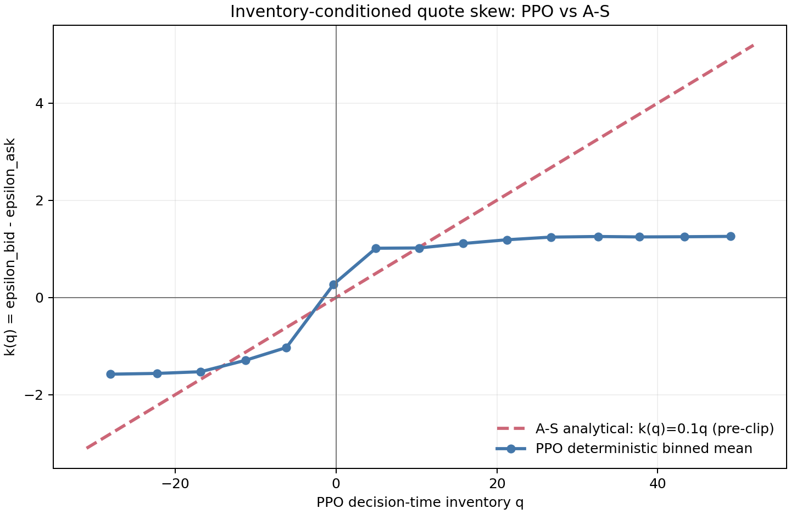

# PPO vs Avellaneda–Stoikov

This is the canonical English report for the final PPO/A-S comparison. The
[Chinese research record](report_zh.md) is retained separately.

## Research Question

The comparison asks two distinct questions:

1. Does a model-free PPO dealer independently learn the economically correct
   inventory-skew direction found in classical A-S control?
2. Does PPO's richer state-dependent quoting and external hedging produce better
   realized economics than the frozen A-S compatibility controller?

The intended claim is not that PPO “learns A-S.” The analytical controller is used
as a structural reference and as a matched economic opponent.

## Experimental Setup

For each of three seeds, the reference PPO policy was trained from scratch against
the same frozen normalized stationary A-S controller for 204,800 environment steps.
The market uses unit investor flow and `sigma=0.2`. The A-S configuration is fixed:

```text
risk_horizon_steps = 26
neutral_epsilon    = 0
inventory_anchor   = 20
hedge_fraction     = 0.
```

Checkpoints are evaluated at `20,480`, `60,416`, `100,352`, `150,528`, and
`204,800` training steps. Each checkpoint uses deterministic PPO actions on ten
fixed, training-independent paths of 20 trading days each, for 5,200 evaluation
steps per seed. The reported standard deviations across seeds are population
standard deviations.

Execution, order flow, price evolution, inventory updates, and PnL are supplied by
the native winner-take-all simulator for both dealers. Every step and aggregate
satisfies

```text
SpreadPnL + InventoryPnL - HedgeCost = TotalPnL.
```

The frozen A-S side-clipping frequency remains below the pre-specified 10% gate in
the final competitive evaluations.

## Inventory-Skew Comparison

Define the relative quote skew

```text
k(q) = epsilon_bid - epsilon_ask.
```

For the frozen A-S controller,

```text
k_AS(q) = 0.1 q
```

before clipping. Positive inventory therefore makes the bid more passive and the
ask more aggressive.

The final pooled deterministic PPO regression is

```text
k_PPO(q) = 0.1255 + 0.0476 q,    R^2 = 0.578.
```

For pooled states with `|q| >= 1`, the PPO skew has the A-S corrective sign in
`96.0%` of states. All three per-seed slopes are positive.



The supported interpretation is:

> PPO independently rediscovers the direction of A-S-like inventory control.

This is weaker and more precise than saying that PPO learns the A-S policy.

## Nonlinearity and State Dependence

The pooled PPO linear sensitivity `0.0476` is less than half the analytical A-S
sensitivity `0.1`. The binned policy also exhibits visible nonlinear saturation:
PPO skew approaches bounded plateaus at large positive and negative inventory rather
than continuing along the analytical pre-clip line.

The symmetric quote level

```text
m = (epsilon_bid + epsilon_ask) / 2
```

has pooled state variation `std(m)=0.4659`. Its inventory-only fit is

```text
m(q) = 0.2813 - 0.0179 q,    R^2 = 0.294.
```

A-S has fixed pre-clip `m=0`, whereas PPO can adjust both the symmetric level and
the relative skew using its full observation. The regression documents association;
it is not a causal attribution of the neural policy to inventory alone.

PPO also uses an external hedge. Its final mean deterministic hedge fraction is
`0.2640`; A-S hedge is identically zero. The hedge fit against `|q|` has slope
`-0.0120` and `R^2=0.320`, so this matched evaluation does not support a simple
claim that PPO hedge fraction rises with inventory magnitude.

## Economic Comparison

Final 204,800-step deterministic evaluation:

| Metric | PPO | A-S | PPO - A-S |
|---|---:|---:|---:|
| Market share | 0.4292 ± 0.3015 | 0.5708 ± 0.3015 | -0.1415 |
| Spread PnL/step | 0.1367 ± 0.0716 | 0.2322 ± 0.1289 | -0.0955 |
| Spread/unit | 0.0179 ± 0.0030 | 0.0195 ± 0.0016 | -0.0016 |
| Normalized spread monetization | 0.8130 ± 0.1336 | 0.8889 ± 0.0720 | -0.0760 |
| Inventory PnL/step | 0.0131 ± 0.0058 | 0.0066 ± 0.0271 | +0.0065 |
| Hedge cost/step | 0.0158 ± 0.0040 | 0 | +0.0158 |
| Total PnL/step | 0.1340 ± 0.0796 | 0.2388 ± 0.1252 | -0.1048 |
| Mean absolute inventory | 8.780 ± 5.801 | 9.581 ± 1.972 | -0.801 |
| Inventory standard deviation | 9.937 ± 3.981 | 7.670 ± 2.057 | +2.266 |

A-S has higher mean total PnL and wins 2/3 seed paths. PPO wins 1/3. This is a
matched result under the stated simulator and evaluation protocol, not a claim that
A-S is generally superior across market models.

## PnL Decomposition

The mean PPO-minus-A-S total-PnL gap satisfies

```text
-0.1048 = -0.0955 + 0.0065 - 0.0158,
```

corresponding to

```text
total gap = spread gap + inventory-PnL gap - hedge-cost gap.
```

The central economic conclusion is:

> The gap is primarily lower spread capture plus PPO hedge cost, not adverse
> inventory PnL.

PPO has slightly better mean inventory PnL, but this is not enough to offset its
lower spread capture and nonzero external hedge cost.

## Seed Heterogeneity

| Seed | Skew intercept | Skew slope | R² | Corrective sign for `|q|>=1` | `std(m)` | Mean hedge |
|---:|---:|---:|---:|---:|---:|---:|
| 0 | -0.0519 | 0.0747 | 0.594 | 100.0% | 0.2804 | 0.2758 |
| 1 | 0.6443 | 0.0205 | 0.348 | 100.0% | 0.2728 | 0.0910 |
| 2 | 0.4146 | 0.0284 | 0.596 | 77.6% | 0.3775 | 0.4251 |

Every seed has a positive inventory-skew slope, but slope magnitude, intercept,
corrective-sign frequency, quote-level variation, hedge usage, market share, and PnL
are heterogeneous. The pooled regression summarizes a common direction; it is not a
complete policy model and should not replace the per-seed robustness check.

## Interpretation

The comparison supports three conclusions:

1. PPO learns an inventory-control direction consistent with classical A-S logic.
2. PPO implements a weaker, nonlinear, state-dependent control law rather than the
   same analytical rule.
3. Additional policy flexibility and external hedging do not produce higher mean
   economics in this matched final experiment.

The negative economic result is retained because it separates behavioral learning
from benchmark performance. A policy can rediscover an economically meaningful
control principle without outperforming a simpler analytical controller.

## Limitations

- A-S is a normalized stationary compatibility implementation, not an empirical
  calibration of exponential Poisson arrival intensities.
- Winner-take-all execution is discontinuous and omits partial fills, queue position,
  and continuous LOB dynamics.
- The PPO regression is pooled over three learned policies and is descriptive rather
  than causal.
- Five checkpoints and three seeds show substantial heterogeneity; they do not
  establish asymptotic convergence.
- PPO and A-S differ in available controls because PPO may hedge externally while
  the frozen A-S benchmark may not.
