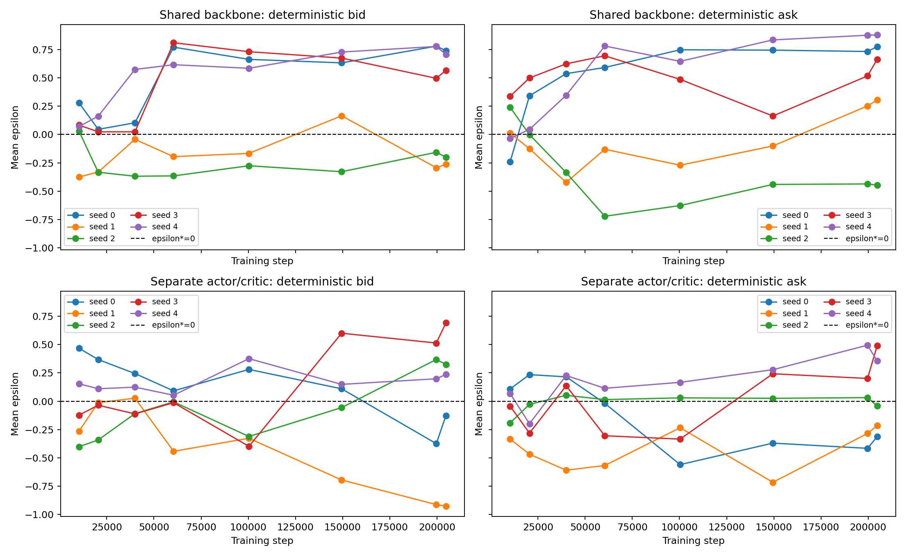

# Separate Actor/Critic Long-Run Investigation

## 结论

把 shared actor/critic backbone 拆成两个独立的 `2 x 256 tanh` MLP 后，long-run drift **明显减轻，但没有消失**：

- Final deterministic two-side MAE 从 shared 的 `0.5542` 降至 `0.3582`，下降约 35.4%；
- 40k-60k 的 aggregate runaway drift 大幅减轻，60k combined MAE 从 `0.5670` 降至 `0.1623`；
- Final per-seed MAE dispersion 从 `0.2135` 降至 `0.1608`，下降约 24.7%；
- 但 separate 仍出现 seed 1 `bid=-0.916` 和 seed 3 `bid/ask=0.622/0.497`，worst-side error 反而从 `0.878` 升至 `0.916`。

因此证据支持：

> **Shared backbone 是原 40k-60k runaway drift 的一个重要贡献因素，但不是 long-run instability 的唯一原因。Separate networks 延缓并减轻了 drift，却没有产生稳定 convergence。**

本轮到此停止，不继续调 `vf_coef`、entropy、learning rate、optimizer 或 PPO。下一步更合理的是检查 observation/input scaling，而不是继续扩展 network architecture。

## 实验控制

唯一主动变化：

```text
Shared:
  h = f_theta(s)
  mu = W_pi h
  V = W_V h

Separate:
  h_pi = f_theta_pi(s)
  mu = W_pi h_pi
  h_V = f_theta_V(s)
  V = W_V h_V
```

Actor 与 critic 各自为独立的 `2 x 256 tanh` MLP，仍由同一个 optimizer 更新。Actor MLP 与 policy head 的初始化顺序保持和 shared policy path 一致。

以下全部不变：20 unit investors、Random competitor `U[-1,1]`、market sigma `0.2`、learning rate `5e-5`、PPO clip `0.3`、10 epochs、entropy/reward/observation、bounded tanh-Gaussian、204,800 steps 和相同 5 seeds。

Sanity check 已确认：只对 value loss backward 时，actor MLP 和 policy head 不产生 gradient，而 critic MLP/value head 正常产生 gradient。

## Q1：Final deterministic two-side MAE 是否明显下降？

**是，平均 MAE 明显下降，但仍远未收敛到 0。**

| Final metric | Shared | Separate | Change |
|---|---:|---:|---:|
| Bid MAE | 0.4949 +/- 0.2235 | 0.4413 +/- 0.2894 | -10.8% |
| Ask MAE | 0.6135 +/- 0.2109 | 0.2751 +/- 0.1583 | -55.2% |
| Two-side MAE | 0.5542 +/- 0.2135 | 0.3582 +/- 0.1608 | -35.4% |
| Worst-side error | 0.8784 | 0.9158 | +4.3% |

平均改善主要来自 ask side。Bid MAE 只小幅下降，且 bid signed dispersion 从 `0.4462` 增至 `0.5274`。因此不能把结果描述为全面、稳健的 convergence。

Final per-seed policies：

| Seed | det bid | det ask | Two-side MAE | latent sigma bid | latent sigma ask |
|---:|---:|---:|---:|---:|---:|
| 0 | -0.1412 | -0.3015 | 0.2214 | 0.9615 | 0.9862 |
| 1 | -0.9158 | -0.1696 | 0.5427 | 0.9816 | 0.9910 |
| 2 | 0.3265 | -0.0390 | 0.1827 | 0.9874 | 0.9892 |
| 3 | 0.6218 | 0.4966 | 0.5592 | 0.9850 | 0.9879 |
| 4 | 0.2011 | 0.3685 | 0.2848 | 0.9829 | 0.9952 |

## Q2：40k-60k 后的 runaway drift 是否减轻或消失？

**明显减轻，但没有消失；更准确地说是被延迟并重新分布到不同 seeds。**

| Step | Shared two-side MAE | Separate two-side MAE | Shared dispersion | Separate dispersion |
|---:|---:|---:|---:|---:|
| 10,240 | 0.1700 | 0.2157 | 0.0715 | 0.0973 |
| 20,480 | 0.1905 | 0.2077 | 0.0540 | 0.0556 |
| 39,936 | 0.3374 | 0.1853 | 0.0728 | 0.0827 |
| 60,416 | 0.5670 | 0.1623 | 0.2133 | 0.1778 |
| 100,352 | 0.5193 | 0.3015 | 0.1708 | 0.0858 |
| 149,504 | 0.4806 | 0.3237 | 0.2308 | 0.2255 |
| 199,680 | 0.5310 | 0.3790 | 0.2277 | 0.1283 |
| 204,800 | 0.5541 | 0.3718 | 0.2134 | 0.1740 |

Shared 的主要 runaway window 在 40k-60k；separate 在这一窗口仍接近 0，说明 critic gradients 通过 shared representation 干扰 actor 是合理机制之一。但 separate trajectories 在 100k 后重新 drift/oscillate，尤其 seed 1 bid 最终接近下界。因此 drift 没有被根治。



## Q3：Seed dispersion 是否明显下降？

**综合误差 dispersion 有中等幅度下降，但不同 side 的结果不一致。**

- Per-seed two-side MAE dispersion：`0.2135 -> 0.1608`，下降约 24.7%；
- Signed ask dispersion：`0.4817 -> 0.3093`，明显下降；
- Signed bid dispersion：`0.4462 -> 0.5274`，反而上升；
- Worst-side error：`0.8784 -> 0.9158`，没有改善。

因此 separate network 提升了 average seed stability，但仍有单侧 catastrophic seed，不能称为稳定 replication。

## Policy variance 与 secondary metrics

| Metric | Shared | Separate |
|---|---:|---:|
| latent sigma bid | 0.9868 +/- 0.0077 | 0.9797 +/- 0.0093 |
| latent sigma ask | 0.9891 +/- 0.0097 | 0.9899 +/- 0.0031 |
| market share | 0.3620 +/- 0.1567 | 0.4965 +/- 0.1537 |
| spread PnL / step | 0.1122 +/- 0.0159 | 0.1177 +/- 0.0137 |

Latent sigma 仍约为 0.98-0.99，separate backbone 没有解决 policy concentration。Market share 改善与 ask mean error 降低一致，但这些是 secondary evidence。

## 最终判断

三个问题的直接回答：

1. **Final two-side MAE 明显下降：是，约下降 35.4%，但仍为 0.358。**
2. **40k-60k runaway drift：明显减轻，但后期 drift/oscillation 仍存在。**
3. **Seed dispersion：综合下降约 24.7%，但 bid dispersion 和 worst seed 没有改善。**

Shared backbone hypothesis 得到部分支持，但不足以解释全部 long-run instability。按照本轮边界，不继续做网络或 PPO 调参；后续若继续，应优先检查 observation/input scaling。

